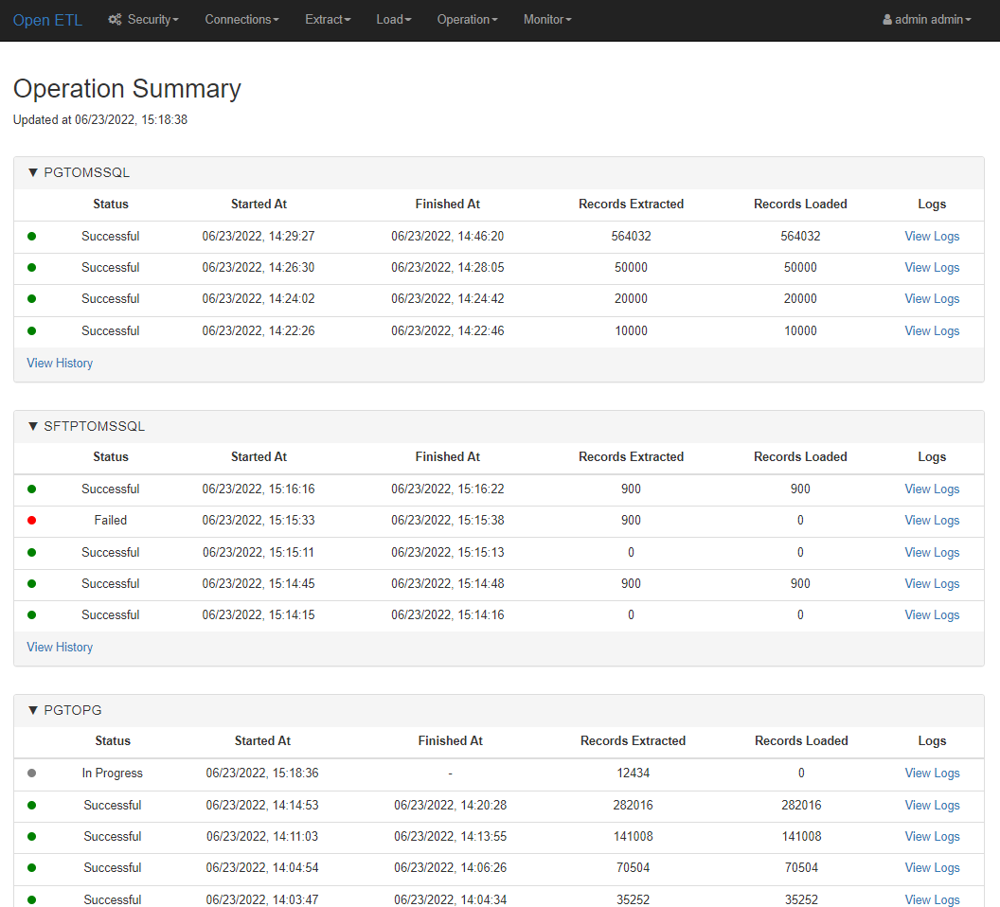
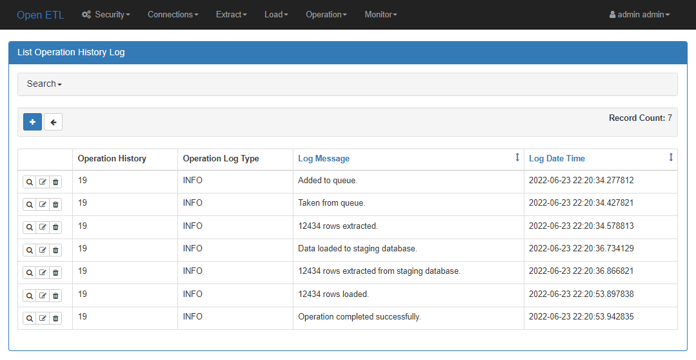
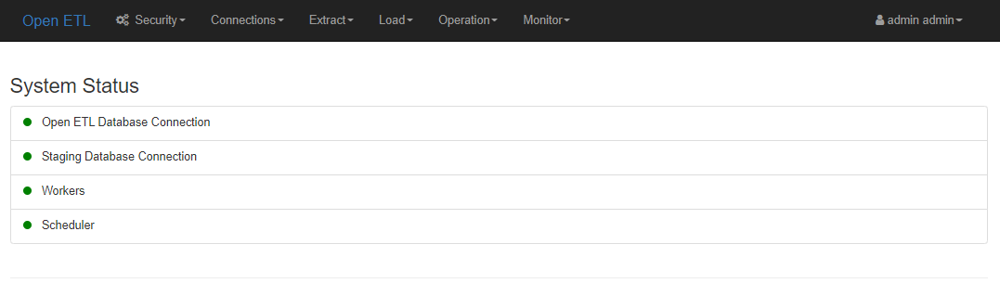
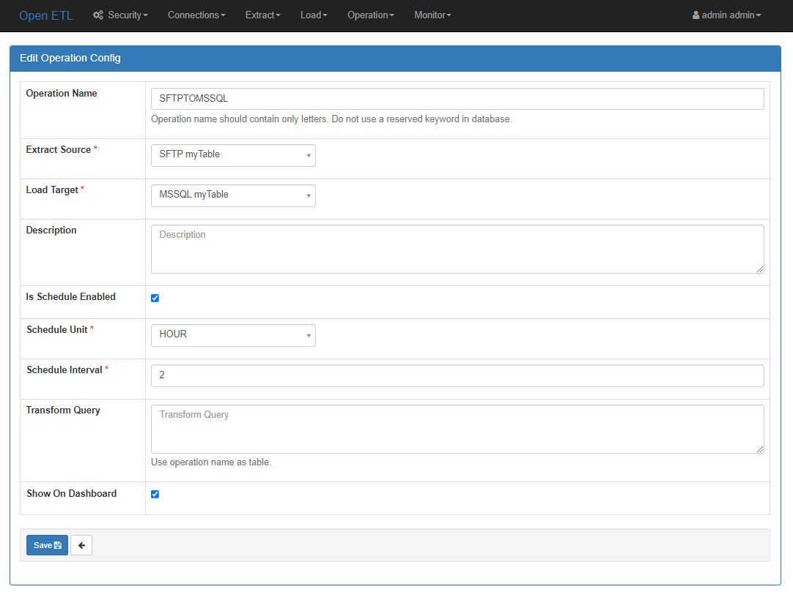
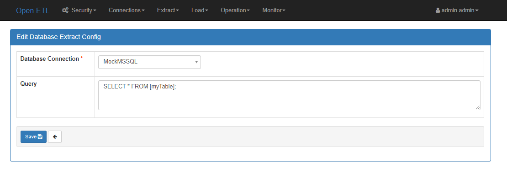
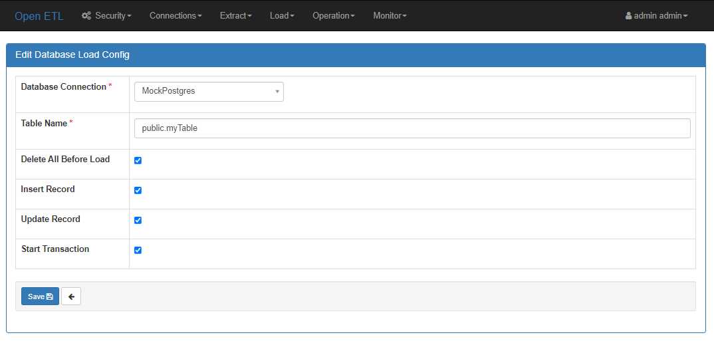
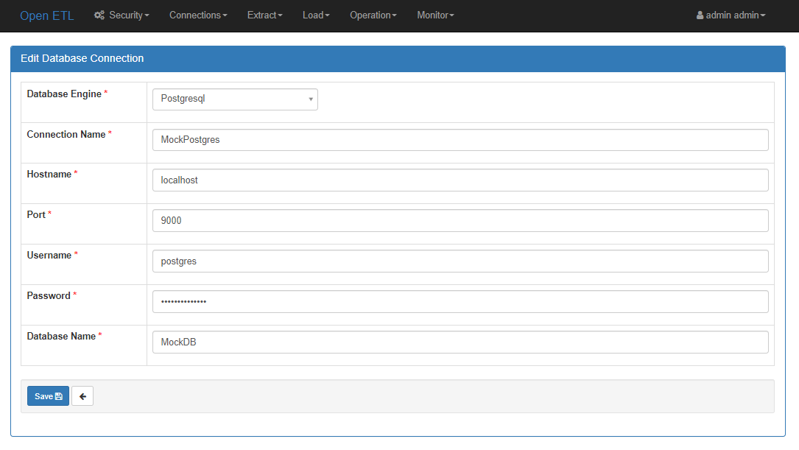

[](https://opensource.org/licenses/Apache-2.0)

[](https://hub.docker.com/r/mert019/open-etl)

# Open ETL

<div style="margin-bottom: 16px;">
    
</div>

Open ETL is a simplified tool to extract data from data sources, process data and to load the extracted & processed data to data targets. 

## Why Open ETL?
Easy to install and configure. \
Simplified web based interface to create ETL operations. \
Detailed monitoring of the ETL operations.

## Screenshots
\
**Dashboard**
\

<br>
\
**Operation Logs**
\

<br>
\
**System Status**
\

<br>
\
**Operation Configuration**
\

<br>
\
**Data Source Configuration**
\

<br>
\
**Data Target Configuration**
\

<br>
\
**Database Connection**
\

<br>

## Supported Data Sources
Open ETL can extract data from databases (MS SQL Server, Postgresql) and XLSX & CSV files from FTP/SFTP servers. If you want additional data sources please create an issue.


## Supported Data Targets
Open ETL can load the extracted data to databases (MS SQL Server, Postgresql). If you want additional data targets please create an issue.


## Transform Operations
Transform operations handled by utilizing staging database.

## Installation and Configuration
### Using Docker
```console
git clone https://github.com/mert019/open-ETL
cd open-ETL
docker-compose up -d
```
Go to http://localhost:8080/ \
Default admin user:
  - username: admin
  - password: password

### Configuration
For more information visit https://hub.docker.com/r/mert019/open-etl

## Contributing
Pull requests are welcome. For major changes, please open an issue first to discuss what you would like to change.
